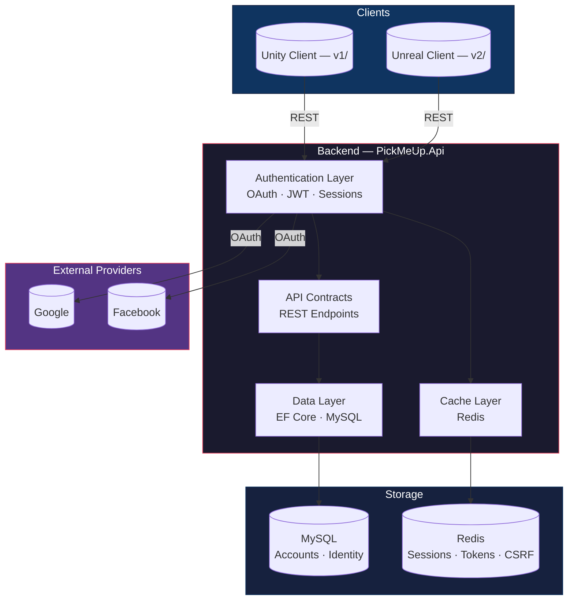
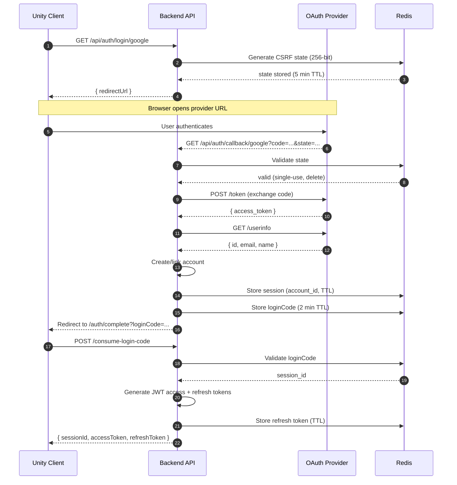
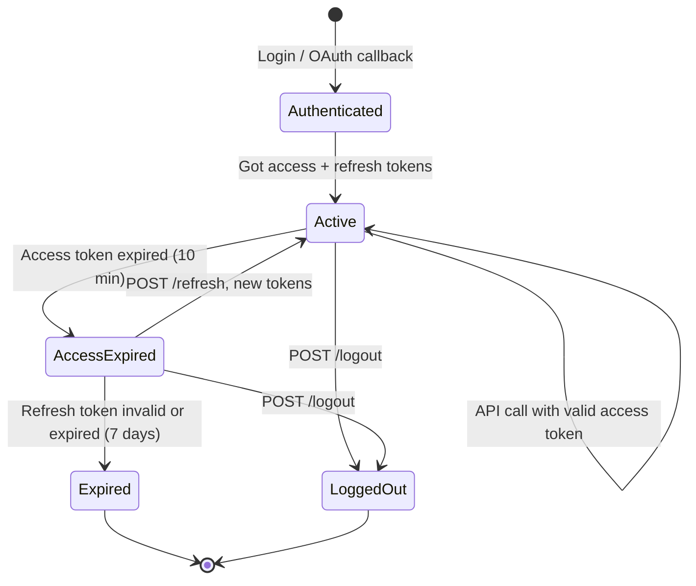
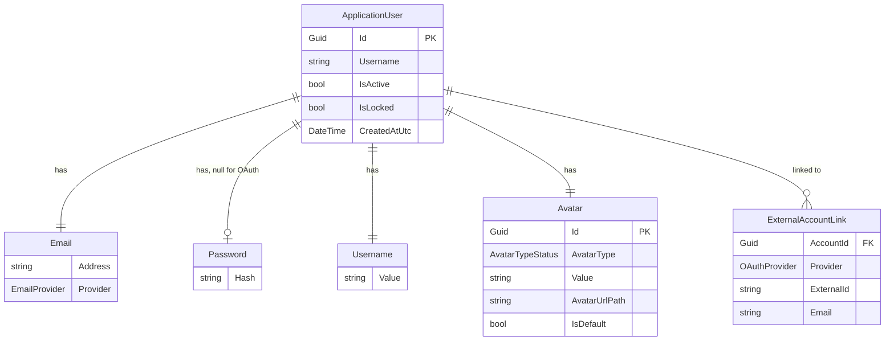
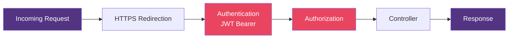
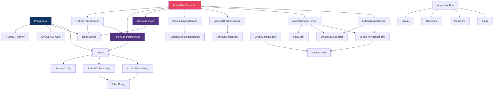

# PickMeUp.Api — Backend API

**Runtime:** .NET 10 · **Language:** C# · **Database:** MySQL + Redis

---

## System Architecture



---

## Project Structure

```
PickMeUp.Api/
├── Program.cs                         Entry point, service wiring
│
├── Account/
│   ├── ApplicationDbContext.cs        EF Core Identity DbContext
│   ├── ApplicationUser.cs             User entity (Identity)
│   ├── Settings.cs                    Game settings (placeholder)
│   │
│   ├── Authentication/
│   │   ├── Email.cs                   Email value object
│   │   ├── Password.cs                Password value object (hashed)
│   │   │
│   │   ├── OAuth/                     ── OAuth Flow ──
│   │   │   ├── Provider/
│   │   │   │   ├── GoogleProvider.cs       Google config value object
│   │   │   │   ├── FacebookProvider.cs     Facebook config value object
│   │   │   │   ├── Google/                 Google API DTOs
│   │   │   │   └── Facebook/               Facebook API DTOs
│   │   │   │
│   │   │   ├── UnifiedAuthController.cs    Main auth controller
│   │   │   ├── ExternalLoginService.cs     Redirect URL builder
│   │   │   ├── OAuthCallbackHandler.cs     Code exchange + userinfo
│   │   │   ├── AccountCreationService.cs   New account from OAuth
│   │   │   ├── AccountLinkingService.cs    Link OAuth to account
│   │   │   ├── OAuthStateValidator.cs      CSRF protection (Redis)
│   │   │   ├── OAuthConfigLoader.cs        Reads config → provider objects
│   │   │   ├── OAuthProviderRegistry.cs    Provider lookup
│   │   │   ├── OAuthErrorHandler.cs        HTTP + JSON error handling
│   │   │   ├── OAuthExceptions.cs          Exception hierarchy
│   │   │   ├── ExternalIdentity.cs         Normalised identity record
│   │   │   └── OAuthProviderExtentions.cs  Enum + extension methods
│   │   │
│   │   └── Session/                   ── JWT + Sessions ──
│   │       ├── Jwt.cs                     JWT config root
│   │       ├── TokenConfig.cs             Base token config
│   │       ├── AccessTokenConfig.cs       Short-lived (minutes)
│   │       ├── RefreshTokenConfig.cs      Long-lived (days)
│   │       ├── TokenGeneratorService.cs   Token creation
│   │       ├── RefreshTokenService.cs     Token rotation
│   │       ├── SessionService.cs          Server-side sessions
│   │       ├── SessionConfig.cs           Session config
│   │       └── RefreshController.cs       Refresh endpoint
│   │
│   ├── Profile/
│   │   ├── Avatar.cs                  Avatar value object
│   │   └── Username.cs                Username value object
│   │
│   └── UserCenter/                    User center (placeholder)
│       ├── Agreement.cs
│       ├── BindAccount.cs
│       ├── OTP.cs
│       └── TestCenter/
│
└── Properties/
```

---

## Stack

| Layer | Technology | Purpose |
|---|---|---|
| Runtime | .NET 10 | Host |
| Database | MySQL (Pomelo EF Core 9.0) | Account persistence |
| Cache | Redis (StackExchange) | Sessions, refresh tokens, CSRF state |
| Identity | ASP.NET Identity (EF Core) | User management, password hashing |
| Auth | Google OAuth, Facebook OAuth | External sign-in |
| Tokens | JWT (HMAC-SHA256) | API authentication |
| Env | DotNetEnv 3.1 | Secret loading from `.env` |
| API | OpenAPI | Documentation |

---

## Authentication Flow

### OAuth Login



### Token Lifecycle



---

## Entity Relationships



---

## Middleware Pipeline



---

## Folder Dependency Map



---

## Configuration

All secrets are loaded from `.env` via DotNetEnv.

| Variable | Purpose |
|---|---|
| `GOOGLE_CLIENT_ID` / `GOOGLE_CLIENT_SECRET` | Google OAuth |
| `FACEBOOK_APP_ID` / `FACEBOOK_APP_SECRET` | Facebook OAuth |
| `MYSQL_HOST` / `MYSQL_PORT` / `MYSQL_DATABASE` / `MYSQL_USER` / `MYSQL_PASSWORD` | MySQL connection |
| `REDIS_CONNECTION` | Redis connection string |
| `JWT_SECRET` | Access token signing key |
| `JWT_REFRESH_TOKEN` | Refresh token signing key |
| `JWT_ISSUER` / `JWT_AUDIENCE` | JWT claims |
| `JWT_EXPIRY_MINUTES` | Access token lifetime |
| `JWT_REFRESH_EXPIRY_DAYS` | Refresh token lifetime |
| `SESSION_EXPIRE_HOURS` | Server-side session lifetime |

---

## Running

```bash
dotnet restore
dotnet run
```

Starts on `http://localhost:5137` · OpenAPI at `/openapi` in development.
