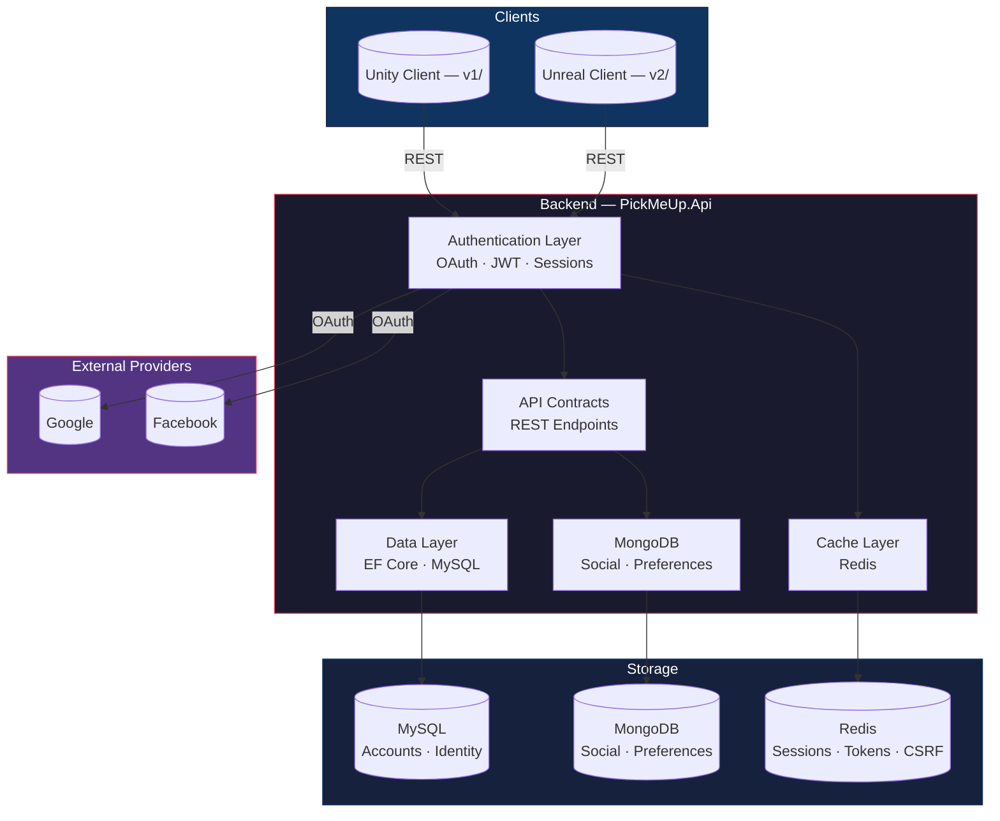
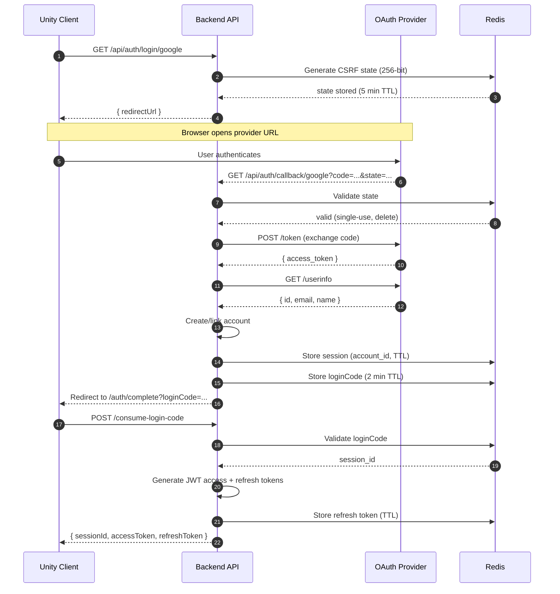
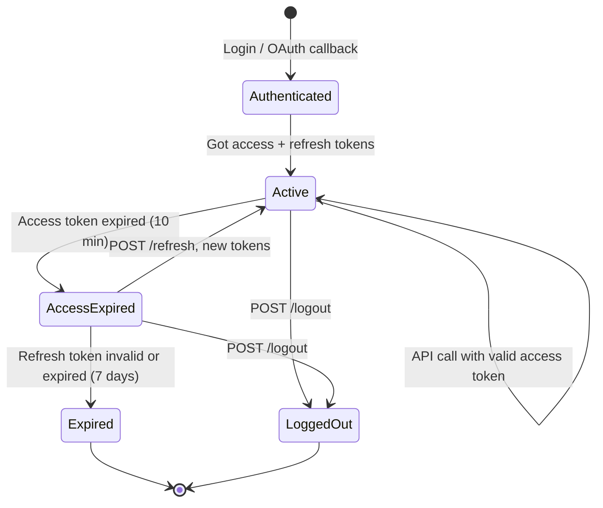
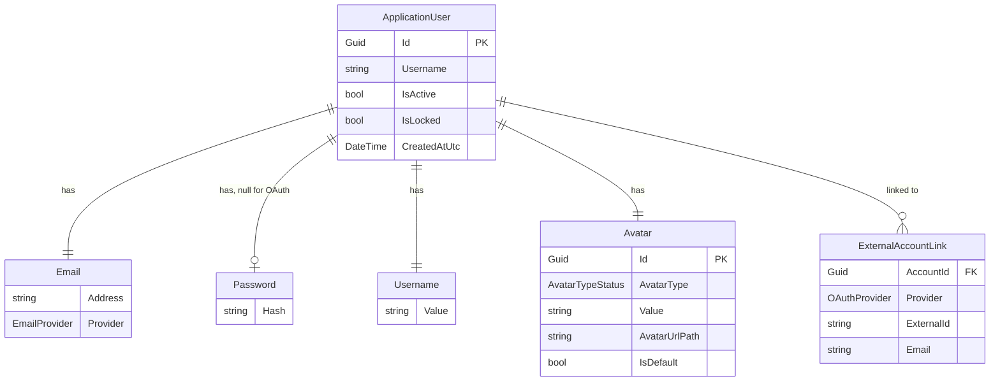

# PickMeUp.Api — Backend API

**Runtime:** .NET 10 · **Language:** C# · **Database:** MySQL + MongoDB + Redis

---

## System Architecture



---

## Project Structure

```
PickMeUp.Api/
├── Program.cs                              Entry point, service wiring
├── .csproj                                 Project file
├── .slnx                                   Solution file
├── appsettings.json                        Configuration
│
├── Account/
│   ├── ApplicationDbContext.cs             EF Core Identity DbContext
│   ├── ApplicationUser.cs                  User entity (Identity)
│   │
│   ├── Authentication/
│   │   ├── Email.cs                        Email value object
│   │   ├── Password.cs                     Password value object (hashed)
│   │   │
│   │   ├── OAuth/
│   │   │   ├── Provider/
│   │   │   │   ├── GoogleProvider.cs       Google config value object
│   │   │   │   ├── FacebookProvider.cs     Facebook config value object
│   │   │   │   ├── Google/                 Google API DTOs
│   │   │   │   └── Facebook/               Facebook API DTOs
│   │   │   ├── UnifiedAuthController.cs    Main auth controller
│   │   │   ├── ExternalLoginService.cs     Redirect URL builder
│   │   │   ├── OAuthCallbackHandler.cs     Code exchange + userinfo
│   │   │   ├── AccountCreationService.cs   New account from OAuth
│   │   │   ├── AccountLinkingService.cs    Link OAuth to account
│   │   │   ├── OAuthStateValidator.cs      CSRF protection (Redis)
│   │   │   ├── OAuthConfigLoader.cs        Config → provider objects
│   │   │   ├── OAuthProviderRegistry.cs    Provider lookup
│   │   │   ├── OAuthErrorHandler.cs        HTTP + JSON error handling
│   │   │   ├── OAuthExceptions.cs          Exception hierarchy
│   │   │   ├── ExternalIdentity.cs         Normalised identity record
│   │   │   └── OAuthProviderExtentions.cs  Enum + extensions
│   │   │
│   │   └── Session/
│   │       ├── Jwt.cs                      JWT config root
│   │       ├── TokenConfig.cs              Base token config
│   │       ├── AccessTokenConfig.cs        Short-lived (minutes)
│   │       ├── RefreshTokenConfig.cs       Long-lived (days)
│   │       ├── TokenGeneratorService.cs    Token creation
│   │       ├── RefreshTokenService.cs      Token rotation
│   │       ├── SessionService.cs           Server-side sessions
│   │       ├── SessionConfig.cs            Session config
│   │       └── RefreshController.cs        Refresh endpoint
│   │
│   ├── Profile/
│   │   ├── Avatar.cs                       Avatar value object
│   │   ├── Username.cs                     Username value object
│   │   │
│   │   └── ProfileSettings/
│   │       ├── AccountPreferencesDocument.cs   MongoDB document
│   │       ├── AccountPreferenceRepository.cs  MongoDB repository
│   │       ├── IAccountPreferenceRepository.cs Repository interface
│   │       │
│   │       ├── Gameplay/
│   │       │   ├── GameplaySettings.cs         Domain model (20 settings)
│   │       │   ├── GameplaySettingsDto.cs      DTO
│   │       │   ├── GameplaySettingsController.cs  GET + PUT
│   │       │   └── GameplaySettingsValidator.cs   FluentValidation
│   │       │
│   │       ├── Accessibility/
│   │       │   ├── AccessibilitySettings.cs    Domain model (14 settings)
│   │       │   ├── AccessibilitySettingsDto.cs DTO
│   │       │   ├── AccessibilitySettingsController.cs  GET + PUT
│   │       │   └── AccessibilitySettingsValidator.cs   FluentValidation
│   │       │
│   │       ├── Language/
│   │       │   ├── LanguageSettings.cs         Domain model
│   │       │   ├── LanaguageSettingsDto.cs     DTO
│   │       │   ├── LanguageSettingsController.cs  GET + PUT
│   │       │   └── LanguageSettingsValidator.cs   FluentValidation
│   │       │
│   │       ├── Notifications/
│   │       │   ├── NotificationSettings.cs     Domain model (5 toggles)
│   │       │   ├── NotificationSettingsDto.cs  DTO
│   │       │   ├── NotificationSettingsController.cs  GET + PUT
│   │       │   └── NotificationSettingsValidator.cs   FluentValidation
│   │       │
│   │       └── Social/
│   │           ├── SocialState.cs              Domain models
│   │           ├── SocialDocument.cs           MongoDB document
│   │           ├── ISocialRepository.cs        Repository interface
│   │           ├── SocialRepository.cs         MongoDB implementation
│   │           ├── ISocialService.cs           Service interface
│   │           ├── SocialService.cs            Service implementation
│   │           ├── IFriendRequestLifecycleEngine.cs  Request lifecycle
│   │           ├── BlockEnforcementMiddleware.cs     Block check middleware
│   │           ├── SocialController.cs         REST endpoints
│   │           ├── FriendCommand.cs            Friend action command
│   │           ├── BlockCommand.cs             Block action command
│   │           └── PartyCommand.cs             Party invite command
│   │
│   └── UserCenter/                         (placeholder, not committed)
│
└── Properties/
```

---

## Stack

| Layer | Technology | Purpose |
|---|---|---|
| Runtime | .NET 10 | Host |
| Database | MySQL (Pomelo EF Core 9.0) | Account persistence |
| Database | MongoDB (Driver 3.12) | Social, preferences |
| Cache | Redis (StackExchange) | Sessions, tokens, CSRF |
| Identity | ASP.NET Identity (EF Core) | User management |
| Auth | Google OAuth, Facebook OAuth | External sign-in |
| Tokens | JWT (HMAC-SHA256) | API authentication |
| Validation | FluentValidation 11.11 | Input validation |
| Env | DotNetEnv 3.1 | Secret loading |
| API | OpenAPI | Documentation |

---

## API Endpoints

### Authentication

| Method | Endpoint | Purpose |
|---|---|---|
| GET | `/api/auth/login/{provider}` | Get OAuth redirect URL |
| GET | `/api/auth/callback/{provider}` | OAuth callback |
| POST | `/api/auth/consume-login-code` | Exchange loginCode for tokens |
| POST | `/api/auth/refresh` | Refresh access token |
| POST | `/api/auth/logout` | Revoke session |

### Account Preferences

| Method | Endpoint | Purpose |
|---|---|---|
| GET | `/account/preferences/gameplay` | Get gameplay settings |
| PUT | `/account/preferences/gameplay` | Update gameplay settings |
| GET | `/account/preferences/accessibility` | Get accessibility settings |
| PUT | `/account/preferences/accessibility` | Update accessibility settings |
| GET | `/account/preferences/language` | Get language settings |
| PUT | `/account/preferences/language` | Update language settings |
| GET | `/account/preferences/notifications` | Get notification settings |
| PUT | `/account/preferences/notifications` | Update notification settings |

### Social

| Method | Endpoint | Purpose |
|---|---|---|
| GET | `/account/social/friends` | List friends |
| POST | `/account/social/friends/requests` | Send friend request |
| DELETE | `/account/social/friends/{id}` | Remove friend |
| GET | `/account/social/blocks` | List blocks |
| POST | `/account/social/blocks` | Block user |
| DELETE | `/account/social/blocks/{id}` | Unblock user |
| POST | `/account/social/party` | Party invite |

---

## Authentication Flow

### OAuth Login



### Token Lifecycle



---

## Entity Relationships



---

## Configuration

All secrets are loaded from `.env` via DotNetEnv.

| Variable | Purpose |
|---|---|
| `GOOGLE_CLIENT_ID` / `GOOGLE_CLIENT_SECRET` | Google OAuth |
| `FACEBOOK_APP_ID` / `FACEBOOK_APP_SECRET` | Facebook OAuth |
| `MYSQL_HOST` / `MYSQL_PORT` / `MYSQL_DATABASE` / `MYSQL_USER` / `MYSQL_PASSWORD` | MySQL connection |
| `REDIS_CONNECTION` | Redis connection string |
| `JWT_SECRET` | Access token signing key |
| `JWT_REFRESH_TOKEN` | Refresh token signing key |
| `JWT_ISSUER` / `JWT_AUDIENCE` | JWT claims |
| `JWT_EXPIRY_MINUTES` | Access token lifetime |
| `JWT_REFRESH_EXPIRY_DAYS` | Refresh token lifetime |
| `SESSION_EXPIRE_HOURS` | Server-side session lifetime |

---

## Running

```bash
dotnet restore
dotnet run
```

Starts on `http://localhost:5137` · OpenAPI at `/openapi` in development.
