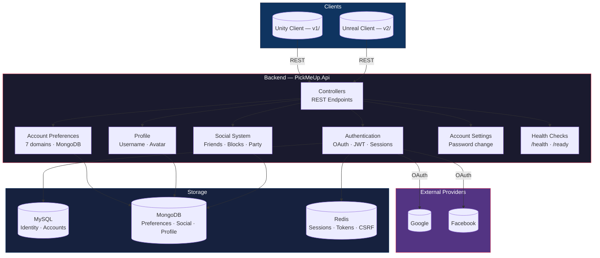

# PickMeUp.Api — Backend API

**Runtime:** .NET 10 · **Language:** C# · **Database:** MySQL + MongoDB + Redis

---

## System Architecture



---

## Project Structure

```
PickMeUp.Api/
├── Program.cs                              Composition root
├── Hosting/
│   ├── EnvLoader.cs                        .env loading (priority precedence)
│   ├── ConfigurationExtensions.cs          Typed options (Jwt, Mongo, MySql, Redis, OAuth)
│   ├── DependencyInjection.cs              AddPickMeUpApi composition root
│   └── RateLimitOptions.cs                 Rate limit config (100 req/min default)
│
├── Common/
│   ├── Authentication/
│   │   ├── ICurrentUser.cs                 Account identity interface
│   │   └── CurrentUser.cs                  JWT claim reader
│   └── Errors/
│       ├── DomainException.cs              Base domain exception
│       ├── ValidationException.cs          Validation error collection
│       ├── VersionConflictException.cs     409 stale version
│       ├── NotFoundException.cs            404 not found
│       └── ProblemDetailsExtensions.cs     Exception → ProblemDetails middleware
│
├── Account/
│   ├── Authentication/                     OAuth + JWT + Session
│   │   ├── Email.cs                        Email value object
│   │   ├── Password.cs                     Password value object
│   │   ├── OAuth/                          Google/Facebook flow
│   │   └── Session/                        JWT + refresh tokens
│   │
│   ├── AccountPreferences/                 7 synced preference domains
│   │   ├── IAccountRepository.cs           Repository interface
│   │   ├── AccountRepository.cs            MongoDB (upsert, versioned PATCH)
│   │   ├── AccountDocument.cs              MongoDB document
│   │   ├── Gameplay/                       20 settings
│   │   ├── Accessibility/                  14 settings
│   │   ├── Language/                       ISO language code
│   │   ├── Notifications/                  5 boolean toggles
│   │   ├── SocialPreferences/              4 visibility rules
│   │   ├── Audio/                          9 volume/mute settings
│   │   └── UiPreferences/                  13 layout settings
│   │
│   ├── AccountSettings/                    Account management
│   │   ├── ChangePasswordRequest.cs        Password change DTO
│   │   ├── ChangePasswordValidator.cs      FluentValidation
│   │   ├── AccountSettingsController.cs    POST /account/settings/password
│   │   └── AccountSettingsExtensions.cs    DI stub
│   │
│   └── Profile/                            Display identity
│       ├── Avatar.cs                       Avatar value object
│       ├── Username.cs                     Username value object
│       ├── ProfileDocument.cs              MongoDB document
│       ├── IProfileRepository.cs           Repository interface
│       ├── ProfileRepository.cs            MongoDB implementation
│       ├── ProfileController.cs            GET/PUT username, PUT avatar
│       ├── ProfileDto.cs                   GET response DTO
│       ├── UpdateUsernameDto.cs             PUT username DTO
│       ├── UpdateAvatarDto.cs              PUT avatar DTO
│       ├── ProfileValidator.cs             FluentValidation
│       └── DependencyInjection.cs          DI registration
│
├── Social/                                 Relationships + invites
│   ├── ISocialRepository.cs
│   ├── SocialRepository.cs
│   ├── SocialController.cs
│   ├── SocialService.cs
│   ├── SocialPolicy.cs
│   └── ... (12 more files)
│
├── DoNotTouchFolder/                       Identity placeholders
│   ├── ApplicationUser.cs
│   ├── ApplicationDbContext.cs
│   └── SharedSettings/UserCenter/
│
└── Properties/
```

---

## Stack

| Layer | Technology | Purpose |
|---|---|---|
| Runtime | .NET 10 | Host |
| Database | MySQL (Pomelo EF Core 9.0) | Identity persistence |
| Database | MongoDB (Driver 3.12) | Preferences, social, profile |
| Cache | Redis (StackExchange) | Sessions, tokens, CSRF |
| Identity | ASP.NET Identity (EF Core) | User management |
| Auth | Google OAuth, Facebook OAuth | External sign-in |
| Tokens | JWT (HMAC-SHA256) | API authentication |
| Validation | FluentValidation 11.11 | Input validation |
| Env | DotNetEnv 3.1 | Secret loading |
| Rate Limiting | Fixed window (100/min) | Per-user throttling |
| Health | /health, /ready | Process + backing service checks |

---

## API Endpoints

### Health

| Method | Endpoint | Purpose |
|---|---|---|
| GET | `/health` | Process up check |
| GET | `/ready` | Backing services check |

### Authentication

| Method | Endpoint | Purpose |
|---|---|---|
| GET | `/api/auth/login/{provider}` | Get OAuth redirect URL |
| GET | `/api/auth/callback/{provider}` | OAuth callback |
| POST | `/api/auth/consume-login-code` | Exchange loginCode for tokens |
| POST | `/api/auth/refresh` | Refresh access token |
| POST | `/api/auth/logout` | Revoke session |

### Profile

| Method | Endpoint | Purpose |
|---|---|---|
| GET | `/account/profile` | Get username + avatar + version |
| PUT | `/account/profile/username` | Update username |
| PUT | `/account/profile/avatar` | Update avatar |

### Account Settings

| Method | Endpoint | Purpose |
|---|---|---|
| POST | `/account/settings/password` | Change password |

### Account Preferences

| Method | Endpoint | Purpose |
|---|---|---|
| GET | `/account/preferences` | All slices + version |
| GET/PUT/PATCH | `/account/preferences/{slice}` | Per-slice operations |
| POST | `/account/preferences/{slice}/reset` | Reset to defaults |
| GET | `/account/preferences/{slice}/defaults` | Get defaults (no auth) |

**Slices:** gameplay, accessibility, language, notifications, social, audio, ui

### Social

| Method | Endpoint | Purpose |
|---|---|---|
| GET/DELETE | `/account/social/friends` | Manage friends |
| GET/POST/DELETE | `/account/social/friends/requests` | Friend requests |
| GET/POST/DELETE | `/account/social/blocks` | Block management |
| GET/POST/DELETE | `/account/social/party/invites` | Party invites |

---

## Configuration

All secrets loaded from `.env` via DotNetEnv.

| Variable | Purpose |
|---|---|
| `GOOGLE_CLIENT_ID` / `GOOGLE_CLIENT_SECRET` | Google OAuth |
| `FACEBOOK_APP_ID` / `FACEBOOK_APP_SECRET` | Facebook OAuth |
| `MYSQL_HOST` / `MYSQL_PORT` / `MYSQL_DATABASE` / `MYSQL_USER` / `MYSQL_PASSWORD` | MySQL |
| `REDIS_CONNECTION` | Redis |
| `JWT_SECRET` | Access token signing |
| `JWT_REFRESH_TOKEN` | Refresh token signing |
| `JWT_ISSUER` / `JWT_AUDIENCE` | JWT claims |
| `JWT_EXPIRY_MINUTES` | Access token lifetime |
| `JWT_REFRESH_EXPIRY_DAYS` | Refresh token lifetime |

---

## Running

```bash
dotnet restore
dotnet run
```

Starts on `http://localhost:5137` · OpenAPI at `/openapi` in development.
