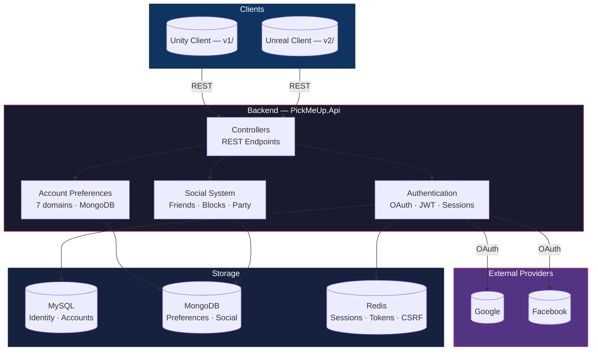

# PickMeUp.Api — Backend API

**Runtime:** .NET 10 · **Language:** C# · **Database:** MySQL + MongoDB + Redis

---

## System Architecture



---

## Project Structure

```
PickMeUp.Api/
├── Program.cs                              Service wiring, middleware pipeline
├── .csproj                                 11 NuGet packages
├── .slnx                                   Solution (single project)
│
├── Account/
│   ├── Authentication/
│   │   ├── Email.cs                        Email value object
│   │   ├── Password.cs                     Password value object (hashed)
│   │   │
│   │   ├── OAuth/
│   │   │   ├── Provider/
│   │   │   │   ├── GoogleProvider.cs       Google config value object
│   │   │   │   ├── FacebookProvider.cs     Facebook config value object
│   │   │   │   ├── Google/                 Token + UserInfo DTOs
│   │   │   │   └── Facebook/               Token + UserInfo DTOs
│   │   │   ├── UnifiedAuthController.cs    Main auth controller
│   │   │   ├── ExternalLoginService.cs     Redirect URL builder
│   │   │   ├── OAuthCallbackHandler.cs     Code exchange + userinfo
│   │   │   ├── AccountCreationService.cs   New account from OAuth
│   │   │   ├── AccountLinkingService.cs    Link OAuth to account
│   │   │   ├── OAuthStateValidator.cs      CSRF protection (Redis)
│   │   │   ├── OAuthConfigLoader.cs        Config → provider objects
│   │   │   ├── OAuthProviderRegistry.cs    Provider lookup
│   │   │   ├── OAuthErrorHandler.cs        HTTP + JSON error handling
│   │   │   ├── OAuthExceptions.cs          Exception hierarchy
│   │   │   ├── ExternalIdentity.cs         Normalised identity record
│   │   │   └── OAuthProviderExtentions.cs  Enum + extensions
│   │   │
│   │   └── Session/
│   │       ├── Jwt.cs                      JWT config root
│   │       ├── TokenConfig.cs              Base token config
│   │       ├── AccessTokenConfig.cs        Short-lived (minutes)
│   │       ├── RefreshTokenConfig.cs       Long-lived (days)
│   │       ├── TokenGeneratorService.cs    Token creation
│   │       ├── RefreshTokenService.cs      Token rotation
│   │       ├── SessionService.cs           Server-side sessions
│   │       ├── SessionConfig.cs            Session config
│   │       └── RefreshController.cs        Refresh endpoint
│   │
│   ├── AccountPreferences/
│   │   ├── IAccountPreferencesRepository.cs    Repository interface
│   │   ├── AccountPreferencesRepository.cs     MongoDB implementation
│   │   ├── AccountPreferencesDocument.cs       MongoDB document
│   │   │
│   │   ├── Gameplay/                       20 settings (action bars, combat, camera, etc.)
│   │   ├── Accessibility/                  14 settings (colors, subtitles, audio, etc.)
│   │   ├── Language/                       Preferred language (12 supported codes)
│   │   ├── Notifications/                  5 boolean toggles
│   │   ├── SocialPreferences/              4 visibility rules (who can message, invite, etc.)
│   │   ├── Audio/                          9 settings (volumes + mute states)
│   │   └── UiPreferences/                  13 settings (layout, positions, scales)
│   │
│   ├── AccountSettings/                    (empty, reserved)
│   └── Profile/
│       ├── Avatar.cs                       Avatar value object
│       └── Username.cs                     Username value object
│
├── Social/                                 (top-level module)
│   ├── ISocialRepository.cs                Repository interface
│   ├── SocialRepository.cs                 MongoDB implementation
│   ├── SocialDocument.cs                   MongoDB document
│   ├── ISocialService.cs                   Service interface
│   ├── SocialService.cs                    Service implementation
│   ├── IFriendRequestLifecycleEngine.cs    Request lifecycle
│   ├── BlockEnforcementMiddleware.cs       Block check middleware
│   ├── SocialController.cs                 REST endpoints
│   ├── FriendCommand.cs                    Friend action command
│   ├── BlockCommand.cs                     Block action command
│   ├── PartyCommand.cs                     Party invite command
│   └── SocialState.cs                      Domain models
│
├── DoNotTouchFolder/                       (do not modify)
│   ├── ApplicationUser.cs                  User entity (Identity)
│   ├── ApplicationDbContext.cs             EF Core DbContext
│   └── SharedSettings/UserCenter/          (placeholders)
│
└── Properties/
```

---

## Stack

| Layer | Technology | Purpose |
|---|---|---|
| Runtime | .NET 10 | Host |
| Database | MySQL (Pomelo EF Core 9.0) | Identity persistence |
| Database | MongoDB (Driver 3.12) | Preferences, social |
| Cache | Redis (StackExchange) | Sessions, tokens, CSRF |
| Identity | ASP.NET Identity (EF Core) | User management |
| Auth | Google OAuth, Facebook OAuth | External sign-in |
| Tokens | JWT (HMAC-SHA256) | API authentication |
| Validation | FluentValidation 11.11 | Input validation |
| Env | DotNetEnv 3.1 | Secret loading |
| API | OpenAPI | Documentation |

---

## API Endpoints

### Authentication

| Method | Endpoint | Purpose |
|---|---|---|
| GET | `/api/auth/login/{provider}` | Get OAuth redirect URL |
| GET | `/api/auth/callback/{provider}` | OAuth callback |
| POST | `/api/auth/consume-login-code` | Exchange loginCode for tokens |
| POST | `/api/auth/refresh` | Refresh access token |
| POST | `/api/auth/logout` | Revoke session |

### Account Preferences

| Method | Endpoint | Domain |
|---|---|---|
| GET/PUT | `/account/preferences/gameplay` | Gameplay (20 settings) |
| GET/PUT | `/account/preferences/accessibility` | Accessibility (14 settings) |
| GET/PUT | `/account/preferences/language` | Language |
| GET/PUT | `/account/preferences/notifications` | Notifications (5 toggles) |
| GET/PUT | `/account/preferences/social` | Social preferences (4 rules) |
| GET/PUT | `/account/preferences/audio` | Audio (9 settings) |
| GET/PUT | `/account/preferences/ui` | UI (13 settings) |

### Social

| Method | Endpoint | Purpose |
|---|---|---|
| GET | `/account/social/friends` | List friends |
| POST | `/account/social/friends/requests` | Send friend request |
| DELETE | `/account/social/friends/{id}` | Remove friend |
| GET | `/account/social/blocks` | List blocks |
| POST | `/account/social/blocks` | Block user |
| DELETE | `/account/social/blocks/{id}` | Unblock user |
| POST | `/account/social/party` | Party invite |

---

## Configuration

All secrets are loaded from `.env` via DotNetEnv.

| Variable | Purpose |
|---|---|
| `GOOGLE_CLIENT_ID` / `GOOGLE_CLIENT_SECRET` | Google OAuth |
| `FACEBOOK_APP_ID` / `FACEBOOK_APP_SECRET` | Facebook OAuth |
| `MYSQL_HOST` / `MYSQL_PORT` / `MYSQL_DATABASE` / `MYSQL_USER` / `MYSQL_PASSWORD` | MySQL connection |
| `REDIS_CONNECTION` | Redis connection string |
| `JWT_SECRET` | Access token signing key |
| `JWT_REFRESH_TOKEN` | Refresh token signing key |
| `JWT_ISSUER` / `JWT_AUDIENCE` | JWT claims |
| `JWT_EXPIRY_MINUTES` | Access token lifetime |
| `JWT_REFRESH_EXPIRY_DAYS` | Refresh token lifetime |
| `SESSION_EXPIRE_HOURS` | Server-side session lifetime |

---

## Running

```bash
dotnet restore
dotnet run
```

Starts on `http://localhost:5137` · OpenAPI at `/openapi` in development.
