# Pick Me Up — Settings & Configuration Architecture

> Reference document · Domain ownership, not UI layout · September 2026
>
> This is an architecture reference, not a C# implementation. It answers:
> what data exists, who owns it, where it lives, whether it syncs,
> what the server must enforce, and what must never be called a setting
> just because it appears in the Settings menu.

---

## 1. Mental Model

When classifying any piece of data, walk these questions in order:

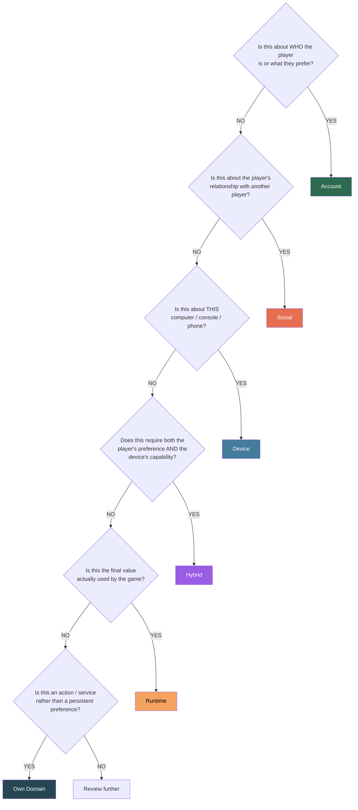

---

## 2. High-Level Map

Player Account owns preferences and identity. Social system owns relationships.
Device owns hardware. Runtime owns the resolved result the client actually applies.

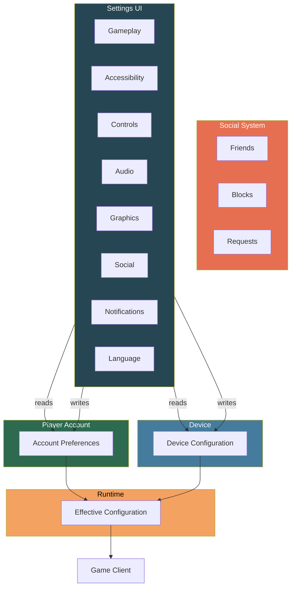

---

## 3. Four Data Categories

### A — Account Preferences

> "How does this player want the game to behave?"

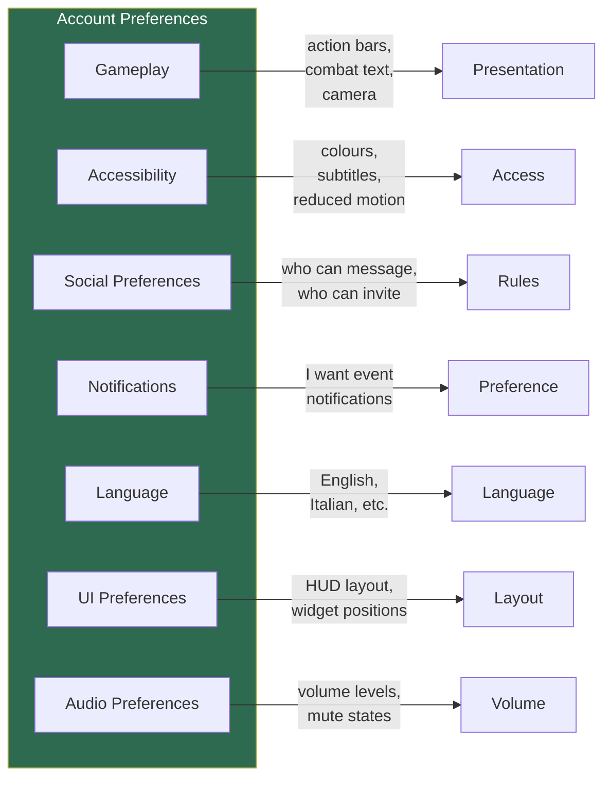

**Owned by:** Account · **Persists:** Backend · **Syncs:** Yes · **Validated:** Yes

### B — Social State

> These are NOT settings, even if the Social tab lives in the Settings screen.

```mermaid
stateDiagram-v2
    [*] --> Pending: Request sent
    Pending --> Accepted: Request accepted
    Pending --> Rejected: Request rejected
    Pending --> Cancelled: Sender cancels
    Pending --> Expired: Time limit reached

    Accepted --> [*]: Friendship active

    state "Block" as Blocked {
        note right of Blocked
            Backend enforces:
            - Cannot message
            Cannot send request
            Cannot invite
            Cannot match
        end note
    }
```

**Owned by:** Social system · **Persists:** Backend · **Syncs:** Yes · **Authoritative:** Server

### C — Device Configuration

> What THIS machine can do and how this install is configured.

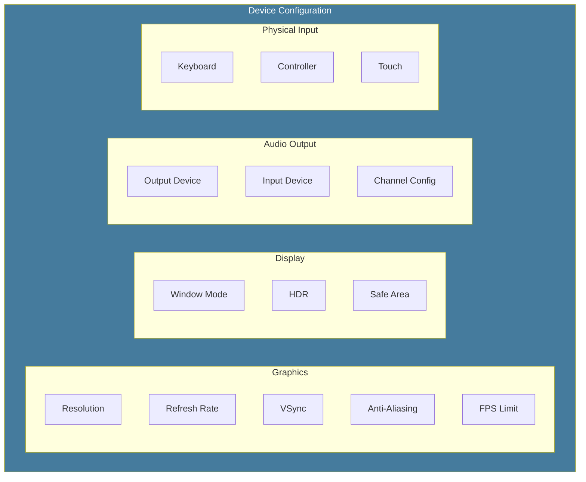

**Owned by:** Device · **Persists:** Local · **Syncs:** No

### D — Effective Runtime Configuration

> Calculated, not a database entity.

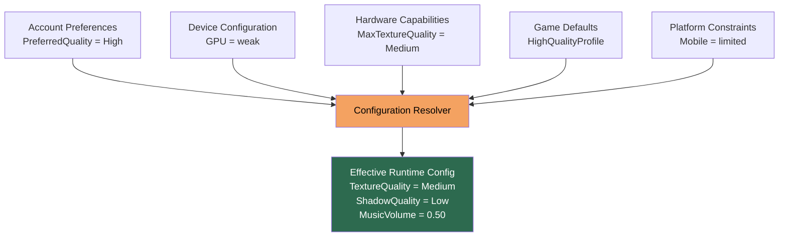

---

## 4. Account Preferences — Breakdown

### 4.1 Gameplay

Client presentation and interaction preferences.

> The server must never treat a client flag as permission to perform an action.

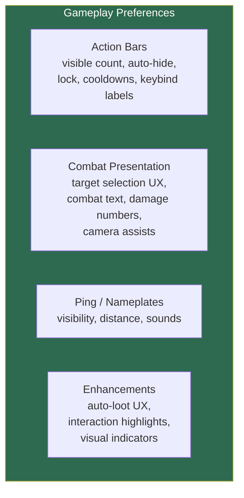

### 4.2 Accessibility

Highly personal. Normally follows the account. May be hybrid because DPI, fonts, and platform capabilities differ.

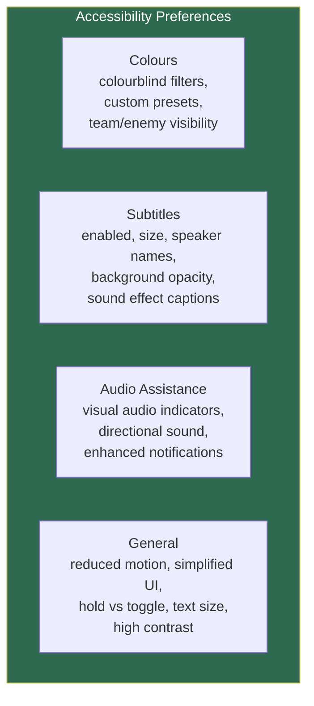

### 4.3 Social Preferences vs Social State

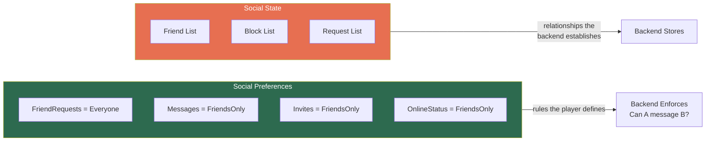

### 4.4 Notification Preferences

> Preference is "I want event notifications."
> Delivery (push, email, in-game) is a separate system.

### 4.5 Language, UI, Audio

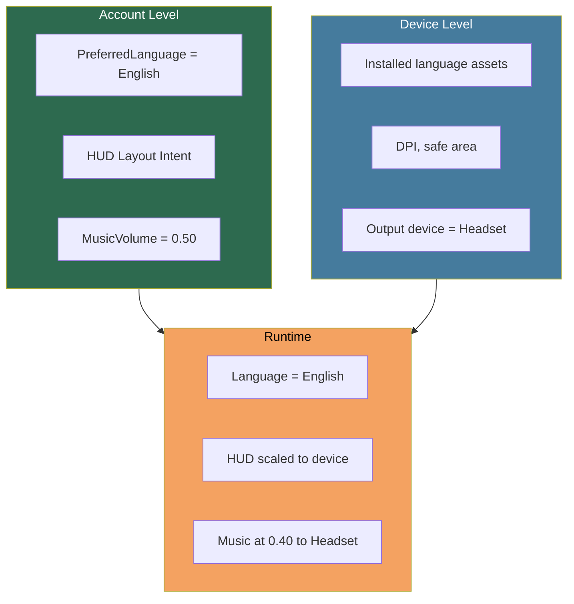

---

## 5. Things That Are NOT Settings

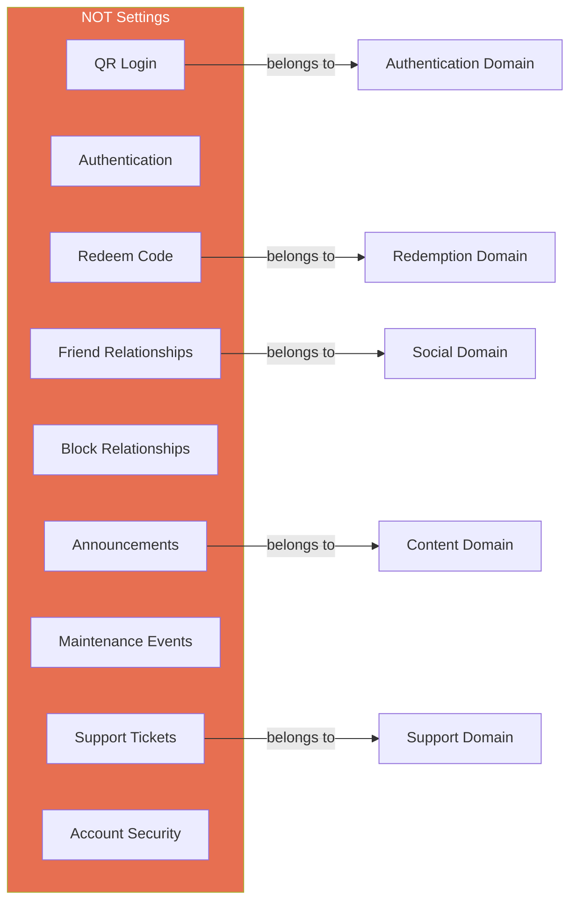

---

## 6. Device Configuration

> One device config object with subdomains. Do not invent a second
> "Performance Settings" owner that repeats the same fields.

### Graphics Preference vs Graphics Configuration

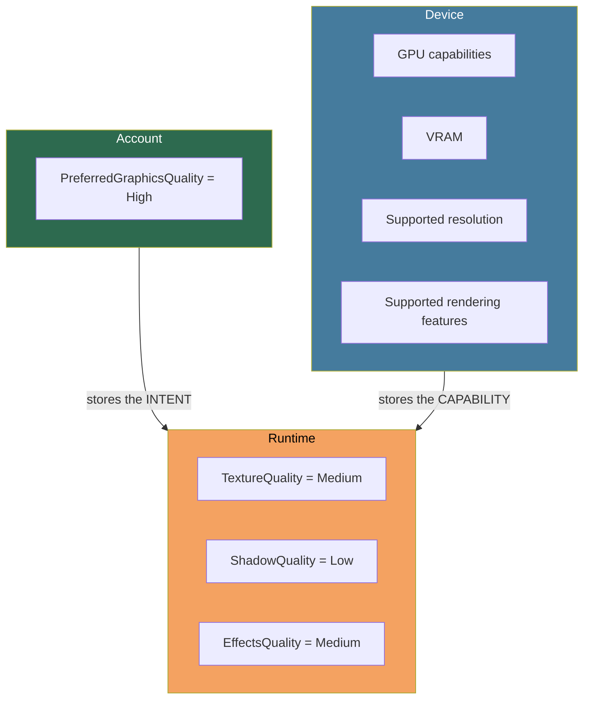

---

## 7. Hybrid Settings

A hybrid setting is one where the PLAYER has a preference but the DEVICE
determines how that preference can actually be realised.

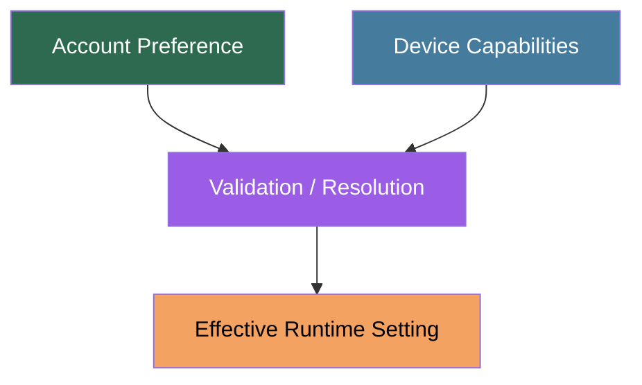

### Hybrid Examples

| Setting | Account Part | Device Part | Runtime Result |
|---|---|---|---|
| **Keybindings** | Logical actions (Jump, Attack) | Physical mappings (Space, A, Touch) | Active mapping for current device |
| **UI** | HUD layout intent | DPI, safe area, resolution | Scaled layout |
| **Audio** | Volume levels | Output device, channel config | Routed audio |
| **Graphics** | Preferred quality tier | GPU capabilities | Actual quality settings |
| **Accessibility** | InterfaceScale preference | DPI, font availability | Rendered scale |
| **Language** | Preferred language | Installed assets | Active language |

---

## 8. Ownership and Authority

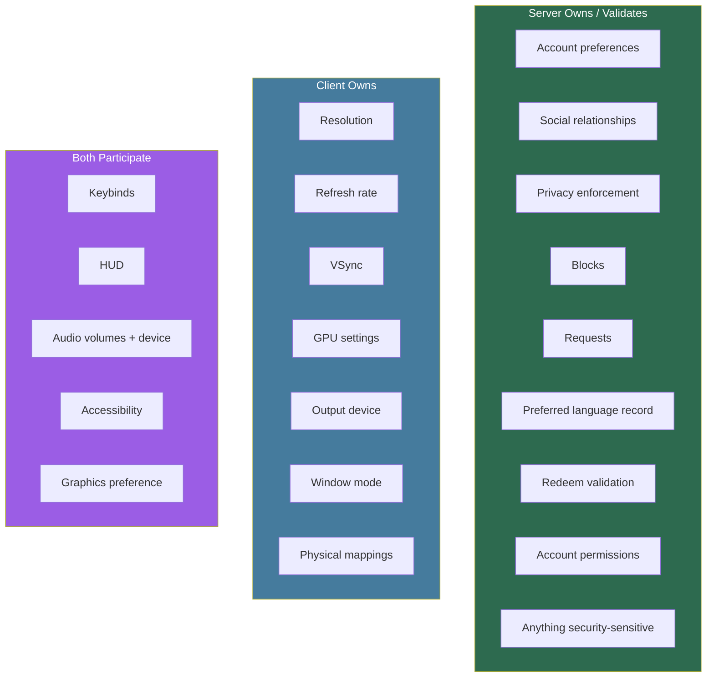

---

## 9. API Shape

> Do not expose one giant Settings endpoint just because the UI is one screen.

### Account Preferences

| Method | Endpoint | Purpose |
|---|---|---|
| GET | `/account/preferences` | All preferences |
| PUT | `/account/preferences` | Update all |
| GET | `/account/preferences/gameplay` | Gameplay prefs |
| PUT | `/account/preferences/gameplay` | Update gameplay |
| GET | `/account/preferences/accessibility` | Accessibility prefs |
| PUT | `/account/preferences/accessibility` | Update accessibility |
| GET | `/account/preferences/social` | Social prefs |
| PUT | `/account/preferences/social` | Update social |
| GET | `/account/preferences/notifications` | Notification prefs |
| PUT | `/account/preferences/notifications` | Update notifications |

### Social State

| Method | Endpoint | Purpose |
|---|---|---|
| GET | `/account/social/friends` | List friends |
| POST | `/account/social/friends/requests` | Send request |
| DELETE | `/account/social/friends/{playerId}` | Remove friend |
| GET | `/account/social/blocks` | List blocks |
| POST | `/account/social/blocks` | Block player |
| DELETE | `/account/social/blocks/{playerId}` | Unblock player |

### Other

| Method | Endpoint | Purpose |
|---|---|---|
| POST | `/account/redeem` | Redeem code |
| * | Auth endpoints | QR / session approval |

> Device settings stay client-local.

---

## 10. Persistence

### Recommended for Pick Me Up

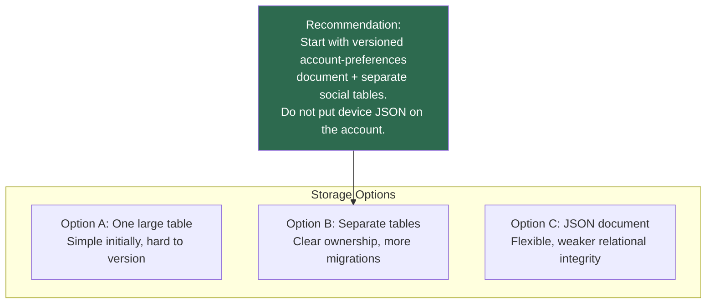

### Defaults

> Prefer storing overrides only. If the player has never changed a setting,
> the database has no entry and the runtime uses the default.
> Explicitly storing every default is acceptable early if it reduces confusion.

### Versioning

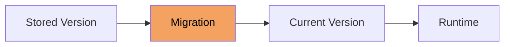

> Add `SettingsVersion` and migrate on read.

---

## 11. Client Storage

| File | Contents |
|---|---|
| `graphics.json` | Resolution, VSync, quality, FPS |
| `input.json` | Keybindings, controller mappings |
| `device.json` | Hardware info, display properties |
| `platform` | Platform preference store |

> Exact storage mechanism decided by the client/engine layer.

---

## 12. Flows

### Startup

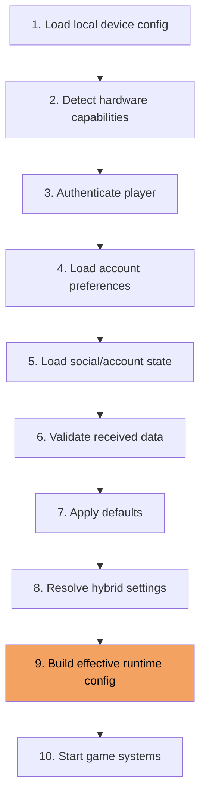

### Update (e.g. Music Volume)

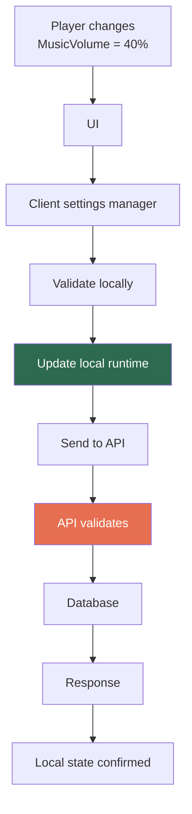

> Backend remains authoritative for persisted account state.

---

## 13. Validation

> Every value entering the backend is untrusted.

| Setting | Valid Range | Reject |
|---|---|---|
| `MusicVolume` | 0.0 — 1.0 | Negatives, huge numbers, NaN |
| `InterfaceScale` | 0.5 — 2.0 | Out of documented range |
| `Language` | Known enum values | Unknown keys |
| `FriendRequests` | `Everyone`, `FriendsOnly`, `Nobody` | Unknown enums |

> Unknown keys on an old client should not crash a new schema.

---

## 14. Settings UI as Orchestrator

The screen can still look like one Settings tree:

```
Settings
├── Gameplay
├── Accessibility
├── Controls
├── Audio
├── Graphics
├── Display
├── Social
├── Notifications
├── Language
├── Account
└── Support
```

But internally the UI calls separate services:

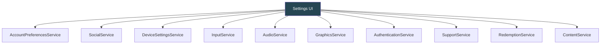

> The UI is a presentation layer, not a domain owner.

---

## 15. Implementation Order

> Do not start with 100 classes. Draw the boundaries first.
> Implement only what the current game needs.

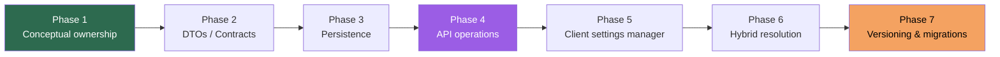

---

## 16. Final Classification

| Domain | Contains |
|---|---|
| **Account** | Gameplay, Accessibility, Social Preferences, Notifications, Language, UI Preferences, Audio Preferences |
| **Social** | Friends, Friend Requests, Blocks, Relationships |
| **Device** | Graphics, Display, Audio Output, Performance, Physical Input, Network Diagnostics |
| **Hybrid** | Keybindings, HUD, Audio, Graphics Preference, Interface Scaling, Accessibility |
| **Runtime** | Effective Graphics, Effective Audio, Effective Input, Effective UI |
| **Other** | Authentication, Redemption, Support, Announcements, Events, Account Security |

---

## 17. Advantages and Costs

### Why Bother

- Clear ownership — hardware does not pollute the account
- Preferences follow the player across devices
- Security stays outside cosmetic flags
- Cross-platform input and UI can coexist
- APIs stay domain-sized instead of one immortal Settings class

### What It Costs

- More boundaries, sync/conflict policy, schema versioning
- Hybrid resolution logic
- Larger test matrix (account only, device only, both, missing data, invalid data, old data)

### Philosophy

> Design the boundaries now.
> Implement only what is currently required.
> That avoids both a blob class and speculative over-engineering.

---

## 18. Final Rule

Never ask whether it appears in the Settings menu.

Ask:

- Who owns this data?
- Where does it need to persist?
- Should it synchronise?
- Is it hardware-specific?
- Is it server-authoritative?
- Does it describe a relationship?
- Is it a preference or an action?
- Is it a raw value or an effective runtime value?

If those answers exist first, the C# structure is easy.

---

## 19. Implementation Status

> Last updated: September 2026

### Resolved — Backend (PickMeUp.Api)

| Domain | Status | Files | Notes |
|---|---|---|---|
| **Gameplay** | ✅ Complete | Settings, DTO, Controller, Validator | 20 settings, FluentValidation |
| **Accessibility** | ✅ Complete | Settings, DTO, Controller, Validator | 14 settings, FluentValidation |
| **Language** | ✅ Complete | Settings, DTO, Controller, Validator | 12 supported codes |
| **Notifications** | ✅ Complete | Settings, DTO, Controller, Validator | 5 boolean toggles |
| **Social Preferences** | ✅ Complete | Settings, DTO, Controller, Validator | 4 visibility rules (enum) |
| **Audio** | ✅ Complete | Settings, DTO, Controller, Validator | 9 settings (volumes + mutes) |
| **UI Preferences** | ✅ Complete | Settings, DTO, Controller, Validator | 13 settings (layout, positions) |
| **Social (relationships)** | ✅ Complete | Repository, Service, Controller, Middleware | Friends, blocks, party invites (MongoDB) |
| **Authentication** | ✅ Complete | OAuth + Session + JWT | Google, Facebook, token rotation, Redis |
| **Persistence** | ✅ Complete | IAccountPreferencesRepository + MongoDB | Per-domain get/update, versioned |

### Resolved — Infrastructure

| Component | Status | Notes |
|---|---|---|
| **Program.cs** | ✅ Wired | All services registered, middleware pipeline |
| **.csproj** | ✅ Complete | 11 packages (MongoDB, FluentValidation, Redis, etc.) |
| **.env loading** | ✅ Working | DotNetEnv, all secrets mapped to config |
| **JWT** | ✅ Working | Access + refresh tokens, Redis-backed sessions |
| **OAuth** | ✅ Working | Google + Facebook, CSRF state, callback flow |

### Still Missing / Needs Work

| Domain | Status | What's needed |
|---|---|---|
| **Account Settings** | ⬜ Empty folder | `AccountSettings/` — reserved, no files yet |
| **Profile (Avatar)** | ⚠️ Placeholder | Value object exists, no controller or persistence |
| **Profile (Username)** | ⚠️ Placeholder | Value object exists, no controller or persistence |
| **Social Preferences** | ⚠️ Partial | Controller exists, but no block enforcement on preference updates |
| **Device Configuration** | ⬜ Not started | Resolution, refresh rate, VSync, GPU — client-side only |
| **Input Configuration** | ⬜ Not started | Logical actions ↔ physical mappings — client-side only |
| **Hybrid Resolution** | ⬜ Not started | Account preference + device capability → effective runtime |
| **Effective Runtime Config** | ⬜ Not started | Calculated object, not a database entity |
| **Settings Versioning** | ⚠️ Partial | Version field exists, no migration logic |
| **Conflict Resolution** | ⬜ Not started | Last-write-wins vs version checks |
| **Client Settings Manager** | ⬜ Not started | Client-side settings coordinator |
| **Tests** | ⬜ Not started | No unit or integration tests yet |
| **MongoDB Index Setup** | ⬜ Not started | Index creation on startup |
| **Health Checks** | ⬜ Not started | `/health`, `/ready` endpoints |
| **CORS** | ⬜ Not started | Required for client communication |
| **Rate Limiting** | ⬜ Not started | User-based request throttling |

### Folder Ownership Summary

| Folder | Owner | Purpose |
|---|---|---|
| `Account/Authentication/` | Shared backend | OAuth, JWT, sessions |
| `Account/AccountPreferences/` | Shared backend | Per-user preference storage |
| `Account/Profile/` | Shared backend | Value objects (Avatar, Username) |
| `Social/` | Shared backend | Friend/block/party relationships |
| `DoNotTouchFolder/` | Reserved | Identity entities, UserCenter placeholders |
| `v1/` | Unity client | Engine-specific implementation |
| `v2/` | Unreal client | Engine-specific implementation |
